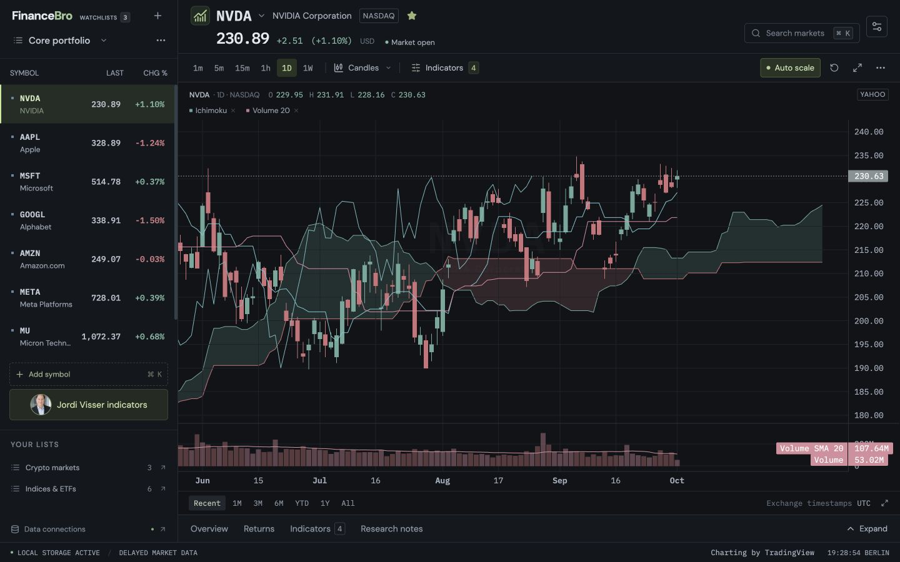

# FinanceBro Research Terminal

**Your charts. Your rules. No subscription.** FinanceBro is a free, open-source, TradingView-style charting page that runs on your own computer. Follow stocks, ETFs, indices and crypto, build your watchlists, and add as many indicators as you want. No paid tiers, no account, and no built-in limits on indicators or watchlist size.

Want something the app does not have yet? Give your AI coding agent this project and ask it to build it: a custom indicator, another data source, or a new research view. You own the code and can keep making it your own. It already comes with 28 indicators, including Ichimoku Cloud and Volume, plus analyst price targets and the Jordi Visser moving-average preset.

Free data providers still have their own rate limits and history windows, and your computer sets the practical performance limit.


FinanceBro is an independent research workspace, not an official TradingView product. It uses the open-source Lightweight Charts library for chart rendering.

## Start locally

Install **Node.js 20+** and **Python 3.10+**, then run from this directory:

```sh
npm run setup
npm start
```

Setup creates `.venv` and installs the backend packages there, then installs frontend dependencies when needed. No global Python packages or account credentials are required. The first setup needs internet access. If Python is installed at a custom path, use `FINANCEBRO_PYTHON=/path/to/python3 npm run setup`.

Open [FinanceBro at 127.0.0.1:5173](http://127.0.0.1:5173). API documentation is available at [127.0.0.1:8000/docs](http://127.0.0.1:8000/docs). Both services bind to your local loopback interface. Press **Ctrl+C** to stop both. If either port is occupied, startup reports the conflict instead of choosing a different port silently.

For an offline, reproducible demonstration after setup:

```sh
FINANCEBRO_DATA_MODE=demo npm start
```

Demo mode uses generated sample prices and volumes. It is useful for exploring and verifying the interface; it does not represent current market conditions.

## Using the workspace

- Search for stocks, ETFs, indices, or crypto, then select a result to open its chart.
- Switch between the timeframes available for that asset. Charts open on approximately 90 recent candles. Pan, zoom, and use the crosshair to inspect candles and OHLCV values.
- Research, data sources, layouts, help and workspace settings are in the gear menu beside market search. The chart has no separate navigation bar.
- **Analyst targets** in the chart toolbar opens published calls for the current stock: analyst name when reported, research firm, publication date, rating/action, previous and new targets, and source/profile links. Search by name, firm or rating; filter named analysts or firm history; sort by date or refresh. This uses recent public Stock Analysis/TipRanks and Finviz tables without an API key. Public history is limited, ratings can differ between sources, and firm-only records explicitly mark missing individual names. See [coverage and source behavior](docs/analyst-targets.md).
- **Auto scale** in the chart toolbar fits the price axis to visible candles. Turn it off to keep the vertical range while panning/zooming, and drag the right price axis to adjust it. The preference persists; **Reset chart view** fits the current candles once even in manual mode. New assets start with a fitted range.
- The lower panel starts collapsed. Open **Overview**, **Returns**, **Indicators**, or **Research notes** to expand it; **Collapse** saves your preference. Chart focus keeps the watchlist on the left.
- Overview return follows the chart timeframe and selected candle, comparing its close with the previous candle close. Open **Returns** for 1D, 1W, 1M, 6M, YTD, 1Y, 2Y, 5Y and 10Y price returns. Daily history loads only when that tab opens. Calendar anchors use the last close on or before the date; YTD uses the prior year final close. Missing history shows —. Returns exclude dividends, and the current candle may still be forming.
- Open **Indicators** in the chart toolbar to browse 28 tools, grouped into Trend, Momentum, Volatility and Volume. Search by name or abbreviation, add independent instances, and edit their periods, colors and visibility in the lower Indicators panel. Ichimoku overlays a shaded cloud; Volume adds up/down bars and a configurable average in its own pane.
- Create multiple watchlists, add or remove symbols, and reorder entries. Watchlists persist in this browser on this origin between sessions.
- **Jordi Visser indicators**, beneath the watchlist, replaces the current indicators with only daily SMA 50 and SMA 200, with current price position and average direction in the legend. The preset and custom colors persist with indicators and saved layouts. Repeated clicks hide/re-enable the existing pair without duplicates. A daily label stays daily when changing chart timeframe: intraday lines use completed UTC daily closes, and weekly lines use the last available daily average in each weekly candle. A weekly chart requests additional daily history for warm-up; source mismatches are reported rather than mixing real and synthetic data. Use **Trend comparison** for 1, 5 or 20 daily bars.
- The watchlist menu’s **Watchlist breadth** opens the four aggregate counts and percentages. It uses eligible names per measure, excluding missing history and synthetic live-mode fallback. A scan runs only on opening, changing the selected list, or pressing Refresh; requests run four at a time. **Show names** exposes each result, source and date.
- Save layouts to return to a symbol, timeframe, chart type, and indicator configuration.
- Open search with **⌘K / Ctrl+K**. Use the star beside a symbol to add it to the current watchlist; drag watchlist rows or use their arrow controls to reorder them.
- Edit periods, colors, and visibility in the **Indicators** tab below the chart. **Research notes** saves a separate note for each symbol as you type.
- Export watchlists as JSON from the watchlist menu, or export the loaded OHLCV as CSV from the chart menu. The workspace settings control quote refresh frequency and compact rows.

## Data provenance and caching

The default `live` mode requests market data through backend providers. Each response identifies its source and includes warnings where needed. Free market data can be delayed and may have missing bars or limited intraday history. Check the displayed source, timestamp, and warning before using a chart for research.

| Assets | Initial provider | Supported intervals | Requested history |
| --- | --- | --- | --- |
| Stocks, ETFs, indices | Yahoo Finance via `yfinance` | 1m, 5m, 15m, 1h, 1D, 1W | Full provider window: 5 days, 1 month, 1 month, 3 months, 2 years, 5 years, respectively |
| Crypto | Coinbase Exchange public API | 1m, 5m, 15m, 1h, 1D | Up to 300 recent candles per interval |

Crypto symbols use USD pairs such as `BTC-USD`; `BTC` and `ETH` search aliases are supported. The Returns tab requests ten years of daily history plus baseline padding. Yahoo supplies a dated window; Coinbase uses successive requests of at most 300 candles. Its results remain limited by trading-pair listing dates. Extended history is cached separately from chart history and has a request deadline of at least 40 seconds. The requested history windows remain subject to provider availability. The initial adapters do not support 4h bars.

When a live provider fails, FinanceBro first tries a previously cached live response and labels it as stale. If none is available, it returns a clearly labeled deterministic **demo fallback**. Demo and fallback series are generated data, not real quotes. Switching to demo mode does not remove stored live data.

Backend quote and OHLCV responses are cached in SQLite at `backend/data/atlas.sqlite3`. The historical cache filename is retained through the rebrand. Set `FINANCEBRO_CACHE_PATH` to choose another file. Quote cache freshness is 30 seconds; historical cache freshness is 60 seconds for intraday data and 300 seconds for daily/weekly data. Live-mode demo fallback expires after at most 30 seconds so the next request can retry the provider. `FINANCEBRO_PROVIDER_TIMEOUT` controls the live-provider timeout in seconds (default `8`).

Watchlists request lightweight quotes. Full history is downloaded only for the opened asset, and recently opened history is reused when available. Indicator calculations run locally on downloaded OHLCV; changing an indicator does not trigger another history download.
Large watchlists update progressively in batches of 25 symbols, prioritizing the opened asset. Polling pauses while the browser tab is hidden and overlapping refreshes are avoided.

Watchlists, saved layouts, and workspace preferences use browser `localStorage`. FinanceBro reads existing `atlas:` settings and saves them under `financebro:`; legacy entries remain intact. They belong to the browser profile and `http://127.0.0.1:5173` origin. Clearing site storage removes them; using another browser or hostname starts a separate workspace. SQLite stores market-data cache, not your browser watchlists.

All `ATLAS_*` environment variables remain supported as legacy aliases. A `FINANCEBRO_*` value takes precedence when both are set.

## Development

```sh
npm run dev                # frontend only; start the backend separately
.venv/bin/python -m uvicorn backend.app.main:app --host 127.0.0.1 --port 8000 --reload
npm run build              # typecheck and production frontend build
npm test                   # indicator, return and breadth calculation tests
.venv/bin/python -m pytest backend/tests
```

The frontend `/api` requests are proxied by Vite to FastAPI on port 8000. The local launcher is a development server; this first milestone does not include a public deployment or multi-user service.

```text
src/                 React workspace, chart components, local indicator engine
backend/app/         FastAPI routes, provider adapters, SQLite caching
backend/data/        Local market-data cache (created on first run)
scripts/             Environment setup and coordinated service launcher
```

## Indicator library

| Category | Indicators |
| --- | --- |
| Trend | SMA, EMA, WMA, DEMA, TEMA, Hull MA, Ichimoku Cloud, Supertrend, ADX / +DI / −DI |
| Momentum | RSI, MACD, Stochastic, Stochastic RSI, CCI, Williams %R, Rate of Change, Awesome Oscillator |
| Volatility | Bollinger Bands, ATR, Donchian Channels, Keltner Channels |
| Volume | Volume + moving average, session VWAP, VWMA, OBV, MFI, Chaikin Money Flow, Accumulation / Distribution |

See [calculation conventions](docs/indicators.md) for warm-up periods, cloud displacement and volume-data limitations.

## Make it yours with an AI agent

Open this repository in your AI coding tool and point it at [AGENT_GUIDE.md](AGENT_GUIDE.md). For example: “Add a 20-day breakout indicator with a period control and show it in the indicator picker.” The guide maps the indicator engine, chart renderer and local API so the agent can make and check a real change. This uses your own coding agent; the app does not include a paid AI service or built-in chat.

## Extending the research terminal

Provider adapters keep search, quotes, history, and fundamentals behind `MarketDataProvider` in `backend/app/providers/base.py`. Implement the protocol and register an adapter in `backend/app/main.py` for the relevant asset types. Keep provider-specific symbols and transformations inside the adapter. The frontend consumes normalized asset, quote, and OHLCV responses.

The indicator engine in `src/lib/indicators.ts` takes downloaded OHLCV and parameterized indicator configurations. Add an `IndicatorKind` in `src/lib/types.ts`, metadata in `INDICATOR_DEFINITIONS`, and a calculator that returns timestamped `IndicatorSeries`. The chart renders the result using its pane metadata. Multiple instances remain independent, so EMA 10, EMA 20, EMA 50, and EMA 200 can coexist.

Calculations use the bars supplied by the provider. EMA starts with a full-window SMA; RSI and ATR use Wilder smoothing. VWAP uses typical price `(high + low + close) / 3`, weighted by reported volume, and resets at midnight UTC. It therefore uses UTC days rather than an exchange-local trading-session calendar.

Python research models implement `ResearchModel` in `backend/app/research.py` and register in `backend/app/main.py`. A working EWMA volatility example is available through `/api/models` and `/api/models/ewma-volatility?symbol=NVDA&timeframe=1D&decay=0.94`. It returns timestamped, labeled points, source provenance, and percent volatility per bar. This is an extension example exposed through the local API; connecting model output to the chart interface is a next step.

The same boundary can support volatility forecasts, regime signals, jump probabilities, and external probability datasets. OpenBB integration, Polymarket database access, derivatives feeds, and ML models are future work.

FinanceBro is a single-user tool. It has no authentication, payment systems, subscriptions, or social infrastructure.

Chart-library attribution is displayed in the footer. See [third-party notices](THIRD_PARTY_NOTICES.md).

## License

Project-authored code is available under the [MIT License](LICENSE). Third-party libraries, photos and other assets retain their own licenses and credits in [THIRD_PARTY_NOTICES.md](THIRD_PARTY_NOTICES.md).
