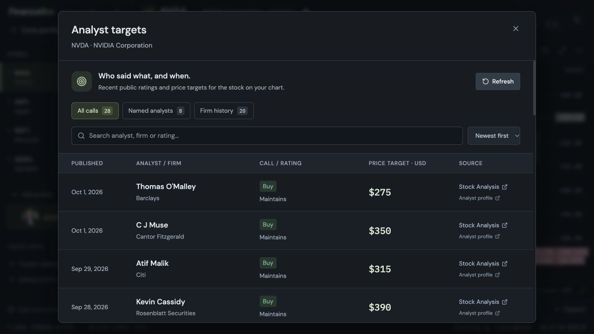

# Analyst targets

The chart toolbar's **Analyst targets** button opens a dated table of calls for the stock currently selected. It loads on demand, leaving the chart unchanged. Each call includes the person when reported, the research firm, rating/action, previous and new targets when supplied, currency and a link to the source's published table. Named calls also link to the analyst profile. These are reported ratings and numerical targets, not quotes or complete research reports.

**Named analysts** filters calls with a supplied individual name; **Firm history** shows entries where only the firm is reported. The counts refer to calls, not unique people. Search accepts names, firms, ratings, actions and ISO dates. Date sorting uses the publication date reported by the source. Retrieval time is separate and shown in local time; publication dates have no invented time or timezone. A missing target is shown as **Not supplied**, and ratings without targets remain visible.

## Public sources

| Source | Coverage used | Limitations |
| --- | --- | --- |
| [Stock Analysis analyst ratings](https://stockanalysis.com/stocks/nvda/ratings/) | Recent public table: analyst person, firm, date, action, rating and target revisions. Individual analyst data is attributed to TipRanks. | The free page exposes a small recent set, currently eight rows on the listings verified. Longer history and advanced filtering are offered through their Pro service. Source ratings may be standardized (for example, Buy) rather than a firm's original terminology. |
| [Finviz stock research](https://finviz.com/stock?t=NVDA) | Public rating history: firm, date, action, original rating labels, target and previous target. | Its column named “Analyst” contains firms, not individual people. These entries remain firm-only. Public row counts vary. |

Only public HTML table content is parsed. Scripts, embedded data payloads, paywalled history and restricted endpoints are not used. A source that returns 403, 429 or an unreadable page is reported as unavailable; the adapter does not bypass the restriction or retry against alternate endpoints. The button currently covers stock listings quoted in USD. Crypto, indices, ETFs and other currencies receive an explicit coverage message.

Calls remain attributed to their original source. Identical rows within a source are deduplicated; differently dated calls across sources are kept separate rather than guessing that they describe the same event. The panel does not calculate a consensus from this partial history or mix older targets into an average. A source link opens the published table, not a fabricated original research article.

## Cache and failures

`GET /api/analyst-targets/{symbol}` resolves the security, requests the two sources concurrently through the bounded provider executor, and caches the normalized response in the existing local SQLite database for 15 minutes. Opening a watchlist does not fetch analyst histories. **Refresh** bypasses a fresh cache; there is no automatic polling. The request uses the configured provider timeout, currently eight seconds by default.

If both sources fail and a prior response contains calls, the old calls remain visible with **Stale cache**, a warning, and their original retrieval date. A partial refresh displays freshly retrieved calls with a warning and preserves the previous complete cache. If there is no usable cache, the panel shows an empty/unavailable state. It never generates synthetic analyst names or targets, including when live chart data falls back to sample prices. Offline sample mode does not request research sources.

Browser requests go through the local FastAPI server. Only the selected ticker is sent to the public research sites; local notes, watchlists and layouts are not uploaded. No API credentials are needed or stored by this implementation.

## API options researched

[Benzinga's Ratings API](https://www.benzinga.com/apis/cloud-product/analyst-ratings-api/) supplies structured analyst names, firms, dates, ratings, current/prior targets and news URLs. Its [documented request](https://www.benzinga.com/apis/blog/mastering-the-ratings-api-analyst-upgrade-signals-for-swing-trading-and-momentum-plays/) requires a Benzinga API token. [Financial Modeling Prep's price-target API](https://site.financialmodelingprep.com/de/developer/docs/price-target-api) also describes named analyst events and article attribution with authenticated API access. These licensed API options are not configured automatically. The working default uses the public venues above, with their explicit history limits.

## Validation

Parser fixtures exercise mobile/desktop duplicate cells, names versus firms, rating changes, current/prior prices, missing targets, invalid dates, mismatched tickers, and restricted pages. Service tests cover per-symbol caching, forced refresh, concurrent requests, partial and stale fallbacks, offline mode and request deadlines. UI filtering and date/price formatting have regression tests. Live verification on 1 October 2026 returned 28 NVIDIA calls (8 named, 20 firm-only) and 27 Apple calls (8 named, 19 firm-only); counts change as source tables update.
