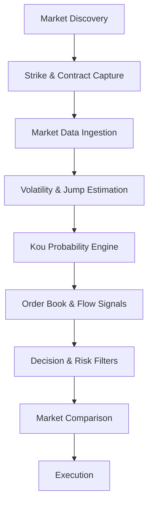

# Architecture

The diagram describes the conceptual production pipeline. Public documentation focuses on the interfaces, research motivation, and evaluation of each stage rather than live production implementation.
