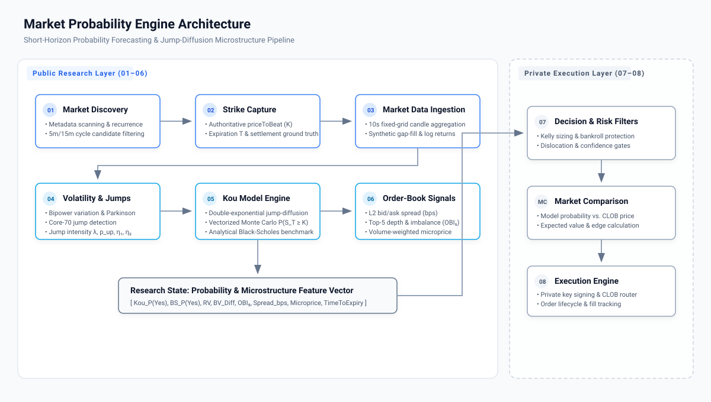

# System Architecture

The **Market Probability Engine** is organized as a modular, feed-forward computational pipeline for estimating terminal probabilities in short-horizon binary prediction contracts.



## Pipeline Flow

```text
Market Discovery
      ↓
Strike & Contract Capture
      ↓
Market Data Ingestion
      ↓
Volatility & Jump Estimation
      ↓
Kou Probability Engine
      ↓
Order-Book Signals
      ↓
Decision & Risk Filters  (Private)
      ↓
Market Comparison       (Private)
      ↓
Execution               (Private)
```

## Stage Descriptions

### Public Research & Mathematical Modeling Layer

1. **`01-market-discovery`**: Ingests market metadata, parses recurrence patterns, identifies underlying assets, and maps outcome tokens.
2. **`02-strike-capture`**: Normalizes contract boundaries, strike values ($K$), contract expiries ($T$), and post-expiration settlement truth.
3. **`03-market-data`**: Groups irregular tick trades into synchronous fixed-interval buckets and produces continuous log-return series for downstream analysis.
4. **`04-volatility-jumps`**: Estimates the continuous volatility component and identifies discontinuous return innovations using robust high-frequency estimators and thresholding methods.
5. **`05-kou-model`**: Evaluates terminal probabilities $P(S_T \ge K)$ using the double-exponential jump-diffusion process via vectorized Monte Carlo simulation alongside a diffusion benchmark.
6. **`06-order-book-signals`**: Extracts L2 market-microstructure indicators including bid/ask spread, top-$N$ depth, imbalance, and microprice.

The parameter choices shown in the public implementation are reference research settings rather than a statement of the current production calibration.

---

### Private Production Layer

The later stages are documented only at a high level and remain in the private production codebase:

7. **`07-decision-risk`**: Combines model outputs with validation, current calibration, risk constraints, and position-sizing logic.
8. **Market Comparison**: Compares model probabilities with tradable market prices and transaction costs.
9. **`08-execution`**: Handles live order submission, signing, fill tracking, cancellations, retries, and operational safeguards.

Current production thresholds, signal combinations, execution code, credentials, and infrastructure details are intentionally not published.
